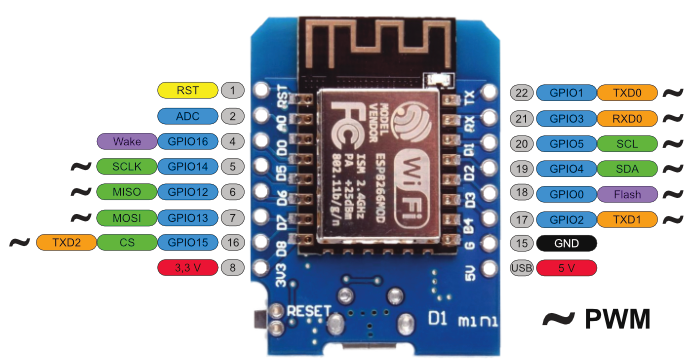

# Arduino Ledmatrix Clock with Weather

A smart ledmatrix-based clock which automatically connects to the configured Wi-Fi network and get your current time, timezone, and location-based weather data.

  

Based on [D1-mini NodeMCU ESP8266](https://www.amazon.de/-/en/dp/B08BTYHJM1) module (8 EUR) and 4 section [MAX7219 Led Matrix](https://www.amazon.de/-/en/dp/B099F3412P) (6 EUR)

# Features

- Connects to configured Wi-Fi access point
- Updates the current time using NTP protocol
- Determines the current location coordinates using GeoIP
- Gets the current full weather info and timezone offset from OpenWeatherMap api
- Display the current time, periodically displaying:
    - Outside temperature
    - The weather description (it's clear, rainy, windy)
    - Outside humidity
    - Wind direction and speed
- Have an option to solder additionally a [DTH20 sensor](https://www.amazon.de/-/en/dp/B0BP7KCX2Q) (5 EUR) to display inner temperature and humidity

# How to assemble the clock

1. You should order wherever (AliExpress or Amazon) a **D1-mini NodeMCU ESP8266** (optionally you can use ESP32 D1-mini as well, but it costs more expensive) and a **MAX7219 8-sections Led Matrix**
2. Solder outputs using this scheme (using **SPI**):

|Led Matrix Pins |Connect to|D1 Mini Pins|
|---|---|---|
|VCC|<->|5v|
|GND|<->|G (GND)|
|DIN|<->|D7 (MOSI)|
|CS|<->|D8 (CS)|
|CLK|<->|D5 (SCLK)|

3. Optionally you can order and connect **DTH20 sensor** using **I2C** interface for displaying inner humidity and temperature

|DTH 20 Pins |Connect to|D1 Mini Pins|
|---|---|---|
|+|<->|3.3v *(or can be taken from ledmatrix VCC 5v pin)*|
|-|<->|G *(or can be taken from ledmatrix GND pin)*|
|SCL|<->|D1 (SCL)|
|SDA|<->|D2 (SDA)|

I personally recommend to fix D1 mini board on the back side of ledmatrix board using either double-sided tap or hot glue gun, and additionally order [USB 5V 1A power adapter](https://www.amazon.de/-/en/dp/B0874VGP2S) and a long USB to microUSB cable.

### D1 Mini Pinouts:

For better understanding D1 mini pins assignment:

# How to build and launch firmware on the device

1. Download [VSCode](https://code.visualstudio.com/)
2. Install PlatformIO plugin in VSCode. Extensions -> search "platformio" -> Install

3. Clone this git repo, or if you don't have a git just use a green button "Code" -> "Download ZIP", and then unzip somewhere
4. On PlatformIO page in VSCode choose "Pick a folder". Choose a folder with the project

5. Connect the device using a very good USB to microUSB cable to a computer. Now we should find out the connected device name:
  - **OS X**: In Terminal type `ls /dev/cu.usbserial*`. Should be something like `/dev/cu.usbserial-141210`.
  - **Linux**: In Terminal type `ls /dev/ttyUSB*`. Should be something like `/dev/ttyUSB0`.
  - **Windows**: You should find in the Device manager in section "Ports (COM and LPT)" something like "USB-SERIAL  CH340 (COM8)". Probably you should install [drivers for CH340C](https://sparks.gogo.co.nz/ch340.html) chip if the device marked as unknown
6. Open a file `platformio.ini` in the project and edit a setting with `upload_port` key with a value of your connected device. E.g. `upload_port = /dev/cu.usbserial-141210` or `upload_port = COM8`
7. Open `Config.cpp` file and edit constants `"WIFI_SSID"` and `"WIFI_PASSWORD"`. Here you should provide wifi access point name and its password
8. On PlatformIO tab choose `Project Tasks` -> `Build`

9. After successfull build choose `Project Tasks` -> `Upload`. If device path was configured correctly on step 6, the firmware will be uploaded on the device and reboot
10. At the same time you can build, upload and monitor in Terminal via `./run.sh` script
12. The clock will be booted, then connect to the confugured Wi-Fi access point, get the current time from NTP server, resolve your location, get the current weather, and finally display the time and periodically the weather details

